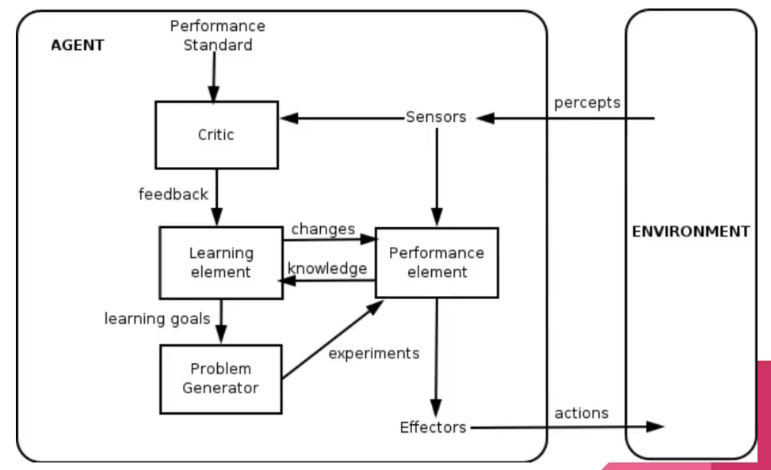

# Introducción a la inteligencia artificial

## Agentes Inteligentes
Son programas de inteligencia artificial basados en lógica, se componen de sensores y actuadores par interactuar con su ambiente.

### Incertidumbre
Uno de los problemas de la inteligencia artificial es la falta de certeza para la toma directa de decisiones, esto debido a las siguientes razones:
* Limitación de los sensores
* Presencia de adversarios
* Ambientes estocásticos
* Pereza
* Ignorancia

### Agentes de reflejo simple

<p align="center">
  
</p>

### Agentes basados en modelos

<p align="center">
  
</p>

### Agentes basados en objetivos

<p align="center">
  
</p>

### Agentes basados en la utilidad

<p align="center">
  
</p>

### Agentes de aprendizaje

<p align="center">
  
</p>

## Ejemplo de agente reflejo simple

<p align="center">
  
</p>

* Considerando este problema ¿cuántos estados posibles hay?
  * Respuesta: 8 estados
<p align="center">
  
</p>

Dependiendo de en que estado inicia, se traslada a otro y tiende a cambiar de rutas, llegando a un estado ciclado debido a que es un agente de reflejo simple.

### Ejemplo en código para simulación:
```HTML
<html>
  <body>
    <h2>Simple reflex agent: Vacuum cleaner</h2>
    <p id="log"></p>
    
    <script type="text/javascript" src="script.js"></script>
    </body>
</html>
```

```JavaScript
function reflex_agent(location, state){
    if (state=="DIRTY") return "CLEAN";
    else if (location=="A") return "RIGHT";
    else if (location=="B") return "LEFT";
}

function test(states){
       var location = states[0];		
       var state = states[0] == "A" ? states[1] : states[2];
       var action_result = reflex_agent(location, state);
       document.getElementById("log").innerHTML+="<br>Location: ".concat(location).concat(" | Action: ").concat(action_result);
       if (action_result == "CLEAN"){
         if (location == "A") states[1] = "CLEAN";
          else if (location == "B") states[2] = "CLEAN";
       }
       else if (action_result == "RIGHT") states[0] = "B";
       else if (action_result == "LEFT") states[0] = "A";		
 setTimeout(function(){ test(states); }, 2000);
}

var states = ["A","DIRTY","DIRTY"];
test(states);
```
